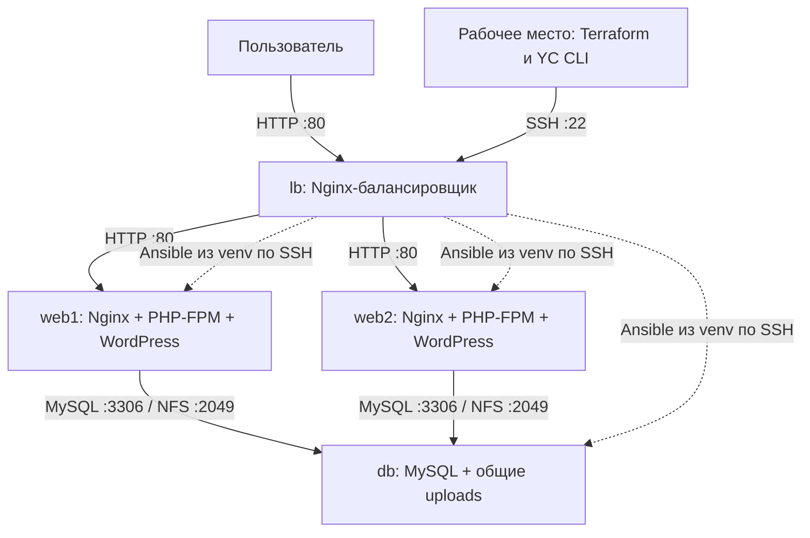

# OTUS_DZ03 — балансировка веб-приложения

Учебный стенд в Yandex Cloud: Terraform создаёт четыре виртуальные машины,
Ansible настраивает Nginx, PHP-FPM, WordPress и общую БД MySQL.
Цель работы — показать round-robin и hash-балансировку, а также обслуживание
запросов при отказе одного веб-узла. Реализуется вариант задания со звёздочкой.

Стенд развёрнут и проверен 22.09.2026: [WordPress](http://89.169.150.186).
Оба алгоритма, отказ Nginx/PHP-FPM на web1 и общие данные проверены;
повторный запуск Ansible — `changed=0`. [Фактические результаты и журналы](docs/verification.md).

## Содержание

- [Описание стенда](#описание-стенда)
- [Инструкция для Windows](#инструкция-для-windows)
- [Инструкция для Linux](#инструкция-для-linux)
- [Результаты и ограничения](#результаты-и-ограничения)

## Описание стенда



| ВМ | Назначение | Внутренний IP |
| --- | --- | --- |
| lb | Балансировщик, SSH jump host и Ansible-контроллер; единственный публичный IP | 10.30.0.10 |
| web1 | Статика Nginx и WordPress через PHP-FPM | 10.30.0.11 |
| web2 | Вторая копия приложения | 10.30.0.12 |
| db | Одна БД MySQL и NFS для загрузок WordPress | 10.30.0.20 |

ОС — Ubuntu 24.04. Каждая ВМ: 2 vCPU, 2 ГБ RAM, доля CPU 20%.
Диски lb/web1/web2 — по 15 ГБ, db — 20 ГБ, всего 65 ГБ HDD.
Приватные ВМ выходят в интернет через NAT gateway. Группы безопасности
разрешают HTTP на web только от lb, MySQL/NFS — только от web-узлов,
SSH на lb — только с адреса администратора. PHP-FPM использует Unix socket.

На рабочем месте запускаются Terraform и YC CLI. Ansible выполняется на lb
в `/home/otus/otus-dz03/.venv`, поэтому пятая ВМ не нужна. На целевых узлах
модули используют `/opt/otus-dz03/venv` с доступом к системному `python3-apt`;
PyMySQL устанавливается только в этот venv.

### Балансировка и общие данные

По умолчанию используется round-robin с одинаковым весом серверов:

```nginx
upstream web_pool {
    zone web_pool 64k;
    server 10.30.0.11:80 max_fails=1 fail_timeout=10s;
    server 10.30.0.12:80 max_fails=1 fail_timeout=10s;
    keepalive 16;
}
```

В режиме hash перед списком серверов добавляется:

```nginx
hash $uri consistent;
```

Ключ — путь без query string. Один путь закрепляется за узлом при неизменном
составе доступных серверов; это не привязка пользовательской сессии.
В ответах видны `X-LB-Method` и `X-Backend-Node`. При сетевой ошибке или
HTTP 502/503/504 балансировщик может повторить запрос на другом узле:

```nginx
proxy_connect_timeout 2s;
proxy_next_upstream error timeout http_502 http_503 http_504;
proxy_next_upstream_tries 2;
proxy_next_upstream_timeout 20s;
```

Обе копии WordPress используют одну БД, одинаковые соли и NFS-каталог
`wp-content/uploads`. Код разворачивается Ansible на обоих узлах; изменение
тем, плагинов и ядра из админки отключено. PHP внутри uploads не исполняется.

### Файлы проекта

| Путь | Содержимое |
| --- | --- |
| `terraform/` | ВМ, сеть, группы безопасности, outputs и пример переменных |
| `ansible/` | Роли common, database, wordpress, loadbalancer и playbook проверок |
| `scripts/` | Установка инструментов, авторизация, управление контроллером и проверки HTTP |
| `.tools/` | Локальные Terraform и YC CLI; в Windows также Python venv |
| `.local/` | Ключи DZ03, секреты, профиль YC, планы и журналы; исключён из Git |
| `docs/verification.md` | Фактически выполненные и запланированные проверки |

Terraform state, реальные tfvars, credentials и приватные ключи в Git не входят.
Системный PATH не изменяется. Все Python-зависимости устанавливаются в venv.

## Инструкция для Windows

Команды `plan` и `plan -destroy` сразу показывают изменения и сохраняют план
через `-out`. Перед `apply` проверить этот вывод; отдельный `show` не обязателен.
Для повторного просмотра позже: `.\scripts\tf.ps1 show ../.local/ИМЯ-ПЛАНА.tfplan`.

### 1. Подготовить рабочее место

Нужны Git, Python 3 и PowerShell. Следующие команды выполняются на рабочем
компьютере. Выбрать каталог для клонирования:

```powershell
git clone --branch develop https://github.com/airiga1897/OTUS_DZ03.git
Set-Location OTUS_DZ03
.\scripts\setup.ps1
. .\scripts\env.ps1
.\.tools\terraform.exe version
.\scripts\yc.ps1 version
```

`setup.ps1` устанавливает инструменты в `.tools` и зависимости в `.tools/venv`.
Чтобы переиспользовать только Terraform и YC из DZ02, вместо обычного setup:

```powershell
.\scripts\setup.ps1 -ReuseProject D:\Projects\Codex\OTUS_DZ02
```

### 2. Настроить доступ и параметры

```powershell
.\scripts\yc.ps1 init
.\.tools\venv\Scripts\python.exe scripts/prepare_local.py
.\.tools\venv\Scripts\python.exe -u scripts/yc_auth.py
```

YC запускается с `--no-browser`; ссылку входа открыть вручную. Скрипты создают
отдельный SSH-ключ DZ03, пароли БД/WordPress и соли в `.local`, а также
`terraform/terraform.tfvars.json`. Существующие значения не перезаписываются.
Проверить в tfvars облако, каталог и `admin_cidrs`. IP определяется через
сервис Яндекса; при первой подготовке его можно задать явно:

```powershell
.\.tools\venv\Scripts\python.exe scripts/prepare_local.py --admin-cidr YOUR_IP/32
```

При смене адреса изменить `admin_cidrs` в существующем tfvars и применить
проверенный план Terraform. При истечении IAM-токена повторить `yc_auth.py`.

Если токен сохраняется вручную из PowerShell, использовать UTF-8 без BOM:

```powershell
$taskToken = & .\scripts\yc.ps1 iam create-token
if ($LASTEXITCODE -ne 0) { throw "Не удалось получить IAM-токен" }
$taskToken = ($taskToken -join "").Trim()
if ($taskToken -notmatch '\A[A-Za-z0-9_.-]{80,}\z') { throw "Некорректный формат токена" }
[IO.File]::WriteAllText((Join-Path $PWD '.local/iam-token'), $taskToken, [Text.UTF8Encoding]::new($false))
Remove-Variable taskToken
```

В Windows PowerShell 5.1 `Set-Content -Encoding utf8` добавляет BOM.
Контроллер поддерживает чтение такого файла, но при ручной записи предпочтителен
приведённый способ. После пересоздания ВМ выполнить `prepare`: он автоматически
получит ключи новых серверов через YC до первого SSH-подключения.

### 3. Создать инфраструктуру

```powershell
. .\scripts\env.ps1
.\.tools\terraform.exe -chdir=terraform init -input=false
.\.tools\terraform.exe -chdir=terraform fmt -check
.\.tools\terraform.exe -chdir=terraform validate
.\scripts\tf.ps1 plan -input=false '-out=../.local/otus-dz03.tfplan'
# После проверки облака, каталога и состава платных ресурсов:
.\scripts\tf.ps1 apply ../.local/otus-dz03.tfplan
.\scripts\tf.ps1 output
.\scripts\tf.ps1 output -raw lb_public_ip
```

План нового стенда содержит четыре ВМ и сетевые ресурсы. Для фиксированного
образа Ubuntu сохранить `image_id` из output `lab` в локальном tfvars.
Без него используется образ семейства Ubuntu 24.04, актуальный на момент запуска.

После apply Terraform автоматически показывает `lb_public_ip` и `site_url`.
Например: `lb_public_ip = "89.169.150.186"`,
`site_url = "http://89.169.150.186"`. При новом развёртывании адрес может отличаться.

### 4. Автоматическая настройка приложения

Предыдущий `terraform apply` уже запускает настройку через
`terraform_data.configuration` → `controller.py deploy`. Отдельная команда
не обязательна. Для ручной диагностики или повторной настройки:

```powershell
.\.tools\venv\Scripts\python.exe -u scripts/controller.py deploy
```

`deploy` последовательно выполняет подготовку, `site.yml --syntax-check`,
`site.yml` и `verify.yml`. При первой ошибке выполнение останавливается;
сообщение об успехе выводится только после завершения всех этапов.
Тесты с остановкой служб остаются отдельным шагом.

Внутри подготовки `prepare` автоматически получает SSH host keys через serial console YC,
проверяет ключ сервера при подключении, загружает исходники и секреты только DZ03, создаёт inventory
и устанавливает Ansible с коллекциями в окружение проекта на lb.
Credentials YC и state на ВМ не передаются.

Отдельная команда `trust` оставлена для диагностики и обновления known_hosts.
В обычном развёртывании она не нужна. Если получить ключи через YC не удалось,
`prepare` останавливается до SSH-подключения; автоматического принятия неизвестных
ключей нет.

Коллекции поставляются пакетом `ansible==14.4.0` из PyPI вместе с
`ansible-core==2.21.4`: `ansible.mysql 5.2.0`, `ansible.posix 2.2.2`.
Отдельная загрузка через API Galaxy не требуется.

Порядок site.yml: общая подготовка → MySQL/NFS → WordPress на web1/web2 → lb.
Адрес сайта — output `site_url`, админка — `/wp-admin/`, пользователь —
`otusadmin`, пароль — `.local/secrets.yml`. Стенд использует HTTP без домена.
После правок выполнить `controller.py upload`, затем повторить `run site.yml`.

### 5. Проверить оба режима и отказоустойчивость

```powershell
.\.tools\venv\Scripts\python.exe -u scripts/controller.py run balance.yml -e nginx_lb_method=hash
.\.tools\venv\Scripts\python.exe -u scripts/controller.py run balance.yml -e nginx_lb_method=round_robin
$lab = (.\scripts\tf.ps1 output -json lab | ConvertFrom-Json)
.\.tools\venv\Scripts\python.exe -u scripts/controller.py exec "cd /home/otus/otus-dz03 && bash scripts/run_checks.sh $($lab.lb_public_ip)"
.\.tools\venv\Scripts\python.exe -u scripts/controller.py run site.yml
```

`verify.yml` проверяет PHP/БД и общее вложение через оба web-узла.
`run_checks.sh` проверяет статику, WordPress, распределение запросов, отказ
Nginx и PHP-FPM на web1 для каждого алгоритма, затем возвращает round-robin.
Повторный site.yml проверяет идемпотентность: ожидается `changed=0`.

Если проверку принудительно прервали, восстановить службы и режим:

```powershell
.\.tools\venv\Scripts\python.exe -u scripts/controller.py run site.yml
.\.tools\venv\Scripts\python.exe -u scripts/controller.py run balance.yml -e nginx_lb_method=round_robin
```

### 6. Удалить стенд

Сначала сохранить нужные данные БД и uploads вне стенда. Выполнять на рабочем
месте с актуальным state. Удаление уничтожает ВМ, их диски и сетевые ресурсы.

```powershell
.\scripts\tf.ps1 state list
.\scripts\tf.ps1 plan -destroy '-out=../.local/otus-dz03-destroy.tfplan'
# После проверки вывода plan: следующая команда удаляет ресурсы без повторного вопроса:
.\scripts\tf.ps1 apply ../.local/otus-dz03-destroy.tfplan
.\scripts\tf.ps1 state list
```

После успешного apply список state должен быть пуст. Проверить отсутствие
ресурсов DZ03 в консоли YC. При ошибке сохранить state и построить новый план
после устранения причины. Сам факт наличия этих команд не запускает destroy.

Перед первым развёртыванием и после destroy команда `scripts/tf.ps1 output`
объясняет отсутствие выходных значений: state ещё не создан или пуст,
а публичный IP появится после успешного apply. Это нормальное состояние,
а не ошибка конфигурации outputs. Вызовы с `-json`, `-raw` или именем output
передаются непосредственно Terraform, чтобы сохранить формат для скриптов.

## Инструкция для Linux

`plan` и `plan -destroy` сразу показывают изменения. Перед `apply` проверить
их вывод. Необязательный повторный просмотр сохранённого плана:
`tf show ../.local/ИМЯ-ПЛАНА.tfplan` (после определения функции `tf` ниже).

### 1. Подготовить рабочее место

Пример для Ubuntu 24.04 и Bash. Это рабочий компьютер администратора;
Ansible по-прежнему запускается на lb.

```bash
sudo apt-get update
sudo apt-get install -y git curl ca-certificates openssh-client python3 python3-venv
git clone --branch develop https://github.com/airiga1897/OTUS_DZ03.git
cd OTUS_DZ03
umask 077
mkdir -p .tools .local
python3 -m venv .venv
.venv/bin/python -m pip install -r requirements-local.txt
.venv/bin/python scripts/install_tools.py
export TF_CLI_CONFIG_FILE="$PWD/terraform.rc"
export YC_CLI_DISABLE_UPDATE_CHECK=1
.tools/terraform version
.tools/yc --no-browser --config "$PWD/.local/yc-config.yaml" version
```

Python-зависимости рабочего места находятся в `.venv`, Terraform/YC — в `.tools`.
Venv между Windows и Linux не копируется: его нужно создавать заново.

### 2. Настроить доступ и параметры

```bash
.tools/yc --no-browser --config "$PWD/.local/yc-config.yaml" init
.venv/bin/python scripts/prepare_local.py
.venv/bin/python -u scripts/yc_auth.py
chmod 700 .local
chmod 600 .local/otus_dz03 .local/secrets.yml .local/iam-token \
  .local/yc-config.yaml terraform/terraform.tfvars.json
```

Ссылку входа открыть вручную. Проверить cloud/folder и `admin_cidrs` в tfvars.
Для явного IP при первой подготовке использовать
`prepare_local.py --admin-cidr YOUR_IP/32`. При смене IP редактируется
существующий tfvars. Истёкший токен обновляется запуском `yc_auth.py` из venv.

Если продолжается уже созданный с Windows стенд, сначала перенести актуальные
state, tfvars, ключи и секреты по [инструкции переноса](docs/linux.md#продолжение-уже-созданного-стенда-с-другого-компьютера).
Пустой state нового клона не описывает существующие ВМ. Не работать одновременно
с двумя копиями локального state и не создавать новые секреты вместо действующих.

### 3. Создать инфраструктуру

В корне проекта определить функцию для текущей Bash-сессии:

```bash
export TF_CLI_CONFIG_FILE="$PWD/terraform.rc"
tf() {
  YC_TOKEN="$(cat .local/iam-token)" .tools/terraform -chdir=terraform "$@"
}
tf init -input=false
tf fmt -check
tf validate
tf plan -input=false -out=../.local/otus-dz03.tfplan
# После проверки облака, каталога и состава платных ресурсов:
tf apply ../.local/otus-dz03.tfplan
tf output
tf output -raw lb_public_ip
```

В новой сессии функцию определить заново. Токен передаётся процессу Terraform;
не включать `set -x` при работе с секретами. Для фиксации образа Ubuntu сохранить
`image_id` из output `lab` в tfvars.

После apply публичный адрес виден в `lb_public_ip`, ссылка на сайт — в `site_url`.
Повторно получить IP можно командой `tf output -raw lb_public_ip`.

### 4. Автоматическая настройка приложения

`terraform apply` автоматически вызывает `controller.py deploy` после создания
ВМ. При необходимости ту же настройку можно запустить вручную с рабочего места:

```bash
.venv/bin/python -u scripts/controller.py deploy
```

`deploy` выполняет подготовку, `site.yml --syntax-check`, `site.yml` и `verify.yml`
последовательно, с остановкой при первой ошибке. Тесты отказов выполняются
отдельно. Подготовка сначала получает ключи через YC, затем загружает исходники,
секреты DZ03 и inventory, создаёт `/home/otus/otus-dz03/.venv` на lb.
Облачные credentials и state остаются на рабочем месте.
Коллекции входят в зафиксированный пакет `ansible==14.4.0` из PyPI;
обращаться к API Galaxy при подготовке не требуется.
После изменений выполнить `controller.py upload`, затем `run site.yml`.

Адрес сайта — output `site_url`; админка — `/wp-admin/`, логин `otusadmin`,
пароль хранится в `.local/secrets.yml`. WordPress инициализируется один раз
в общей БД, код и конфигурация размещаются на обоих web-узлах.

### 5. Проверить оба режима и отказоустойчивость

```bash
.venv/bin/python -u scripts/controller.py run balance.yml -e nginx_lb_method=hash
.venv/bin/python -u scripts/controller.py run balance.yml -e nginx_lb_method=round_robin
LB_IP="$(tf output -json lab | .venv/bin/python -c 'import json,sys; print(json.load(sys.stdin)["lb_public_ip"])')"
.venv/bin/python -u scripts/controller.py exec \
  "cd /home/otus/otus-dz03 && bash scripts/run_checks.sh $LB_IP"
.venv/bin/python -u scripts/controller.py run site.yml
```

Проверяются WordPress, статика, оба алгоритма, отказ Nginx/PHP-FPM на web1
и его возврат в пул. Для hash выбирается путь, первоначально обслуживаемый web1.
Итоговый режим — round-robin; повторный site.yml должен дать `changed=0`.

При необходимости работать прямо на контроллере:

```bash
ssh -i .local/otus_dz03 -o IdentitiesOnly=yes \
  -o StrictHostKeyChecking=yes -o UserKnownHostsFile=.local/known_hosts "otus@$LB_IP"
# Далее команды выполняются в SSH-сессии на lb:
cd /home/otus/otus-dz03/ansible
../.venv/bin/ansible-playbook site.yml
../.venv/bin/ansible-playbook verify.yml
../.venv/bin/ansible-playbook balance.yml -e nginx_lb_method=round_robin
```

Если сценарий отказов был принудительно прерван, повторить site.yml для
восстановления служб и balance.yml для возврата нужного алгоритма.

### 6. Удалить стенд

Вернуться на рабочее место с актуальным state, в корень проекта; функцию `tf`
определить как на шаге 3. Сохранить необходимые БД и uploads вне стенда.
Не запускать destroy с удаляемой ВМ lb.

```bash
tf state list
tf plan -destroy -input=false -out=../.local/otus-dz03-destroy.tfplan
# После проверки вывода plan: следующая команда удаляет ресурсы без повторного вопроса:
tf apply ../.local/otus-dz03-destroy.tfplan
tf state list
```

После успешного удаления state пуст; дополнительно проверить ресурсы в YC.
При частичной ошибке не удалять state: устранить причину и построить новый план.

## Результаты и ограничения

### Ошибка установки и повторный запуск

Настройка приложения — create-time provisioner ресурса `terraform_data.configuration`.
План нового стенда содержит 12 облачных ресурсов и один служебный ресурс Terraform;
пятая ВМ не создаётся. Windows использует `.tools/venv/Scripts/python.exe`,
Linux — `.venv/bin/python`. Окружение и авторизация должны быть подготовлены до plan.

При ошибке настройки `terraform apply` завершается ошибкой. Ресурсы сохраняются,
журнал остаётся в `.local/logs/deploy-*.log`. После исправления причины создать
новый план, проверить его и повторить apply: Terraform повторит неудавшийся
этап настройки. Автоматического rollback/destroy нет; удаление выполняется
только отдельными командами из инструкции.

Изменение Ansible-файлов, Python/Bash-скриптов или идентификаторов ВМ повторно
запускает настройку. Неизменный apply её не повторяет. Для принудительной
перенастройки (например, после изменения локальных секретов или ручного изменения
ВМ) добавить к plan `-replace=terraform_data.configuration`, затем проверить
и применить новый план. Заменяется этап настройки, а не ВМ. Между plan и apply
не изменять исходники. Terraform не обнаруживает произвольные изменения внутри ОС.

Фактически созданная инфраструктура и выполненные проверки описаны в
[отчёте](docs/verification.md). Наличие конфигурации или успешный validate
не подтверждают работоспособность приложения. Полный цикл с Linux-рабочего
места и destroy по приведённым инструкциям пока не проверены.

Проверки Nginx пассивные: недоступность обнаруживается при реальном запросе.
Сценарии проверяют GET при отказе одного веб-сервиса. Уже отправленный POST
автоматически повторять небезопасно; `non_idempotent` не включён.
Балансировщик, MySQL и NFS остаются единичными точками отказа, все ВМ находятся
в одной зоне. HTTPS, резервное копирование и отказ всей зоны в это ДЗ не входят.

Если установка зависимостей или коллекций завершилась ошибкой, устранить её
и повторить prepare до запуска playbook. Не считать частичную установку успехом.
Приложение использует общие данные: удаление db уничтожает записи и uploads.

## Документация компонентов

- [Nginx upstream: алгоритмы и пассивные проверки](https://nginx.org/en/docs/http/ngx_http_upstream_module.html)
- [Nginx proxy_next_upstream](https://nginx.org/en/docs/http/ngx_http_proxy_module.html#proxy_next_upstream)
- [Требования WordPress](https://wordpress.org/about/requirements/)
- [NAT gateway Yandex Cloud](https://yandex.cloud/ru/docs/vpc/concepts/gateways)
